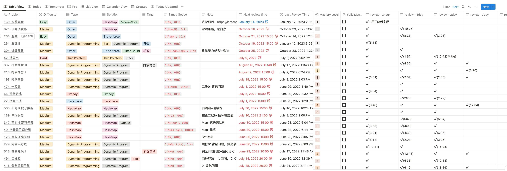

# Notion-Leetcode

用Notion辅助刷Leetcode

Notion 模板如下图：

Notion模版链接地址: https://smart-icecream-3b3.notion.site/Leetcode-2e4a16eb5e9640e68e6b1053d8fae7a3
## 算法分类

- [**Binary Search**](https://www.notion.so/Binary-Search-dfded3b6e0744c27bbff65d487c5e5e5)

- [**Dynamic Programming**](https://www.notion.so/-Dynamic-Programming-9640e63504dc4fc3892321942303efb5)

- [**Sorting**](https://www.notion.so/Sorting-4d82841b88714a09b850da240db6d16e)

- [**Two pointer && Sliding window**](https://www.notion.so/Two-pointer-Sliding-window-5e05ad4dacbb45ce8dd97f3f63286df6)

- [**Linked List**](https://www.notion.so/Linked-List-c256080869cf4906bd1ee908d3330b66)

- [**Hash Table**](https://www.notion.so/Hash-Table-8c373860568c462a8a0bb8c5f2e06288)

- [**Tree**](https://www.notion.so/Tree-5e8ea47510204abab9fb1864f533947c)

- [**Stack & Queue**](https://www.notion.so/Stack-Queue-7673569a1b914628b5d7eb01856854a4)

- [**Other**](https://www.notion.so/Other-c6a95a1d97c74bf585ca927432ca3ce3)

- [**Backtrace**](https://www.notion.so/b4e2d283a9cf4a0da73c26e109e536d7)

- [**Greedy**](https://www.notion.so/0b377892c8044e6bbd094df028743c57)

## 题单

- **[🔥 LeetCode 热题 HOT 100](https://leetcode.cn/problem-list/2cktkvj/)**
- **[👨‍💻 LeetCode 精选 TOP 面试题](https://leetcode.cn/problem-list/2ckc81c/)**
- ****[腾讯](https://leetcode.cn/leetbook/detail/tencent/)****
- **[🐧 腾讯精选练习 50 题](https://leetcode.cn/problem-list/ex0k24j/)**

## Reference

- [https://labuladong.github.io/](https://labuladong.github.io/)
- [https://programmercarl.com/](https://programmercarl.com/)
- [论如何 4 个月高效刷满 500 题并形成长期记忆](https://leetcode.cn/circle/discuss/jq9Zke/)
- [大家都是如何刷 LeetCode 的？](https://www.zhihu.com/question/280279208)
